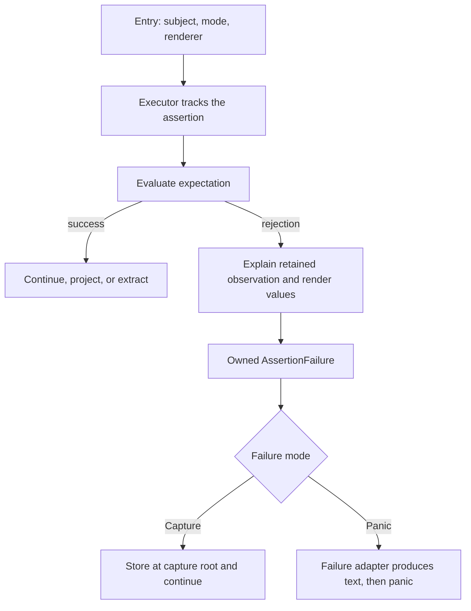

# Assertr architecture

Assertr is a Rust assertion library built around `AssertThat`, a typed chain over a borrowed or owned subject. Subject
capabilities select checks, the mode selects failure handling, and the renderer formats diagnostic leaves. The runtime
supports `no_std` with `alloc`.

These pages explain contributor-facing contracts and their design constraints. Public rustdoc owns API signatures and
usage examples. Source and regression tests establish current behavior. [AGENTS.md](../AGENTS.md) owns contribution
rules. The [glossary](glossary.md) defines preferred terminology.

## From entry to result

An ordinary reusable assertion follows this execution path. Composition uses child contexts inside evaluation and
contributes evidence to the enclosing failure. It does not raise each candidate rejection on the outer chain.

[Lifecycle](assertion-lifecycle.md) explains state and ownership. [Expectation execution](expectation-execution.md)
explains evaluation and continuation. [Rendering](diagnostic-rendering.md) constructs diagnostic values before
[failure processing](failure-processing.md) stores or presents them. Assertion attempts, candidate evaluations, and
failure nodes have [different counts](expectation-execution.md#counts-and-evaluation-scope).

## Start from the change

| Contributor task                              | Reading path                                                                                                                                         |
|-----------------------------------------------|------------------------------------------------------------------------------------------------------------------------------------------------------|
| Add an assertion or support a domain type     | [Extension choice](extension-contract.md#choosing-an-extension), then [evaluation obligations](expectation-execution.md#evaluation-and-explanation). |
| Support a custom collection, map, or set      | [Capability contracts](collection-semantics.md#capability-model). Consult [reference identity](reference-identity.md) for pointer comparisons.       |
| Change composition or structural matching     | [Matcher semantics](matcher-composition.md), then [child scopes](expectation-execution.md#child-scopes-and-evidence).                                |
| Change diagnostic values or reports           | [Rendering](diagnostic-rendering.md), then [failure fields and adapters](failure-processing.md).                                                     |
| Add a consuming, async, or stateful assertion | [Observation boundaries](observation-boundaries.md), then [continuation rules](assertion-lifecycle.md#projections-and-continuation).                 |
| Change fluent entry or procedural macros      | [Fluent expression capture](fluent-entry.md), or [structural macro boundaries](matcher-composition.md#structural-macros).                            |
| Change dependencies or feature gates          | [Platform compatibility](platform-compatibility.md).                                                                                                 |

## Code ownership

[entry](../assertr/src/entry/) and [assert_that](../assertr/src/assert_that/) own chain entry, state transitions,
execution, and callback capture. [assertions](../assertr/src/assertions/) owns assertion families and their reusable
definitions. [expectation](../assertr/src/expectation/) owns shared contracts and generic composition.
[matchers.rs](../assertr/src/matchers.rs) catalogs public expectations with common imports and subject namespaces.

[failure](../assertr/src/failure/) and [renderer](../assertr/src/renderer/) own completed failures and diagnostic
values.
[assertr-macros](../assertr-macros/) generates code against unsupported [__private](../assertr/src/__private/) plumbing.
Unit tests live beside implementations. [Runtime integration tests](../assertr/tests/) and the
[no-std fixture](../assertr-no-std-tests/) exercise downstream contracts.

## Maintaining these pages

Give each contract one owning page. Link to it elsewhere. Keep implementation details here only when they explain an
observable guarantee or design constraint. Algorithm mechanics belong beside their implementation. Keep worked examples
in rustdoc and use small state or evidence traces here to explain architectural boundaries.

Make the scope of each claim explicit:

- **Type-system guarantees** follow from bounds, lifetimes, or visibility.
- **Implementor obligations** are semantic requirements of a trait, such as repeatable traversal or budget-independent
  results. Rust cannot enforce them all.
- **Executor behavior** describes library-controlled tracking, observation lifetimes, and failure routing. Identify
  current implementation choices separately when they may change without changing the contract.

Front matter has three fields. `id` is a unique lowercase identifier with hyphens. `depends_on` is an inline list of
reading prerequisites, using IDs. Keep only direct prerequisites and no cycles. Optional companions use body links.
`sources` is an indented list of repository-relative paths or globs. Prefer specific implementation files and named
regression tests for important claims. Body links are relative to their page.

Review the relevant implementation and run the named regressions when behavior changes.
