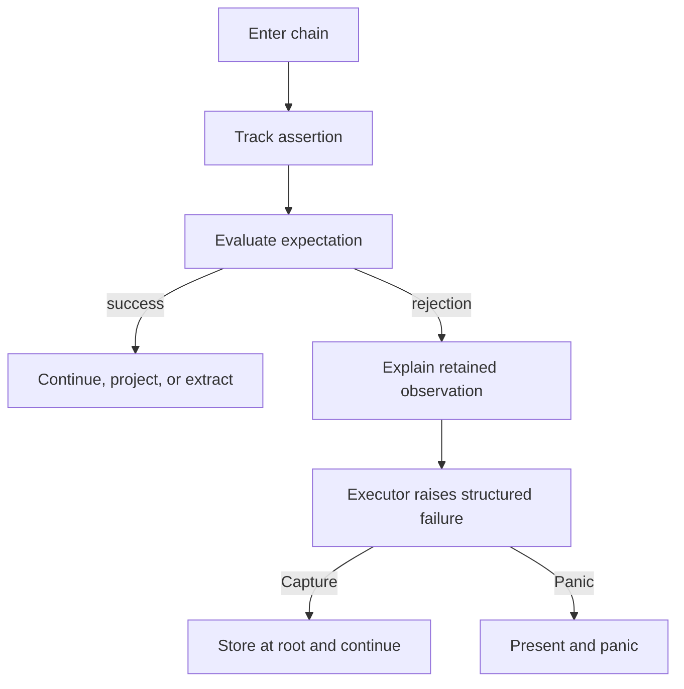

# Assertr architecture

Assertr is a Rust assertion library for `std` and `no_std` with `alloc`. An `AssertThat` chain holds the value being
checked, a failure mode, a renderer, and state shared across assertions. The value's traits determine which assertions
are available. Renderers format individual diagnostic values, while Assertr assembles the report.

## Execution path

```mermaid
flowchart TD
    entry["Enter chain"] --> track["Track assertion"]
    track --> evaluate["Evaluate expectation"]
    evaluate -->|success| continue["Continue, project, or extract"]
    evaluate -->|rejection| explain["Explain retained observation"]
    explain --> failure["Executor raises structured failure"]
    failure -->|Capture| store["Store at root and continue"]
    failure -->|Panic| panic["Present and panic"]
```

Nested checks contribute evidence to the enclosing assertion. [Expectation execution](expectation-execution.md)
explains how evaluation, diagnostics, and failure handling fit together.

## Where to start

Each page covers one part of the library. The [glossary](glossary.md) defines the terms used throughout.

| Page | What it explains |
|---|---|
| [Assertion lifecycle](assertion-lifecycle.md) | How chains store subjects, capture failures, and continue on mapped or derived values. |
| [Expectation execution](expectation-execution.md) | How checks run, count assertions, retain observations, and collect nested failures. |
| [Comparison operands](comparison-operands.md) | Which borrowed values comparisons use and when expected values may be accessed again. |
| [Collection semantics](collection-semantics.md) | Which traits enable collection, set, and map assertions, and what membership and exact matching mean. |
| [Iterator execution](iterator-execution.md) | How much input iterator assertions consume, what they retain, and when they release the iterator. |
| [Matcher composition](matcher-composition.md) | How matchers combine checks, callbacks, lists, and structural patterns. |
| [Reference identity](reference-identity.md) | Which addresses same-instance assertions compare and what pointer equality can establish. |
| [Observation boundaries](observation-boundaries.md) | When assertions invoke functions, poll futures, inspect files or locks, and consume responses. |
| [Diagnostic rendering](diagnostic-rendering.md) | How values become diagnostic trees, with renderer bounds, ordering, and size limits. |
| [Failure processing](failure-processing.md) | How structured failures become reports, panics, or explicit output. |
| [Fluent entry](fluent-entry.md) | How fluent methods borrow values, provide aliases, and capture expression text. |
| [Assertion extensions](extension-contract.md) | Which extension point to use and how to test it. |
| [Platform compatibility](platform-compatibility.md) | Which features and platforms are supported, including macro versions and MSRV. |

## Source layout

| Location | Responsibility |
|---|---|
| [entry](../assertr/src/entry/), [assert_that](../assertr/src/assert_that/) | Entry, chain state, execution, projection, capture. |
| [assertions](../assertr/src/assertions/) | Assertion families and their reusable definitions. |
| [expectation](../assertr/src/expectation/) | Shared expectation protocol, composition, assignment evidence. |
| [matchers.rs](../assertr/src/matchers.rs) | Public expectation catalog and subject namespaces. |
| [renderer](../assertr/src/renderer/), [failure](../assertr/src/failure/) | Diagnostic values, completed failures, presentation. |
| [assertr-macros](../assertr-macros/), [__private](../assertr/src/__private/) | Generated code and unsupported runtime plumbing. |
| [Integration tests](../assertr/tests/), [no-std fixture](../assertr-no-std-tests/) | Tests of the public API from outside the crate. Unit tests live beside implementations. |

## Maintaining these documents

These pages explain architecture and the rules contributors must preserve. Keep API signatures and worked examples in
rustdoc, and check claims against source and tests. [AGENTS.md](../AGENTS.md) contains contribution and release instructions.

- Explain each rule in one place and link to it elsewhere. Keep overview and glossary entries brief.
- Write for a reader learning the code. Use concrete descriptions and established terms. Do not shorten prose so far
  that readers must guess what a phrase means.
- Explain behavior, implementor responsibilities, resource lifetimes, side effects, and diagnostic consequences where
  they matter. Keep private algorithm details beside the implementation.
- Give a topic its own page when that makes it easier to find and understand. Pages need not have equal lengths.
- Distinguish what Rust enforces from what implementors must guarantee and what the current implementation happens to do.
- When moving a topic, remove the old explanation and update navigation, glossary links, prerequisites, and source lists.

Each page's front matter contains a unique lowercase, hyphenated `id`, an inline `depends_on` list of direct prerequisites,
and repository-relative `sources` paths or globs. Dependencies must have no cycles. Use relative body links for related
pages that are not prerequisites.
