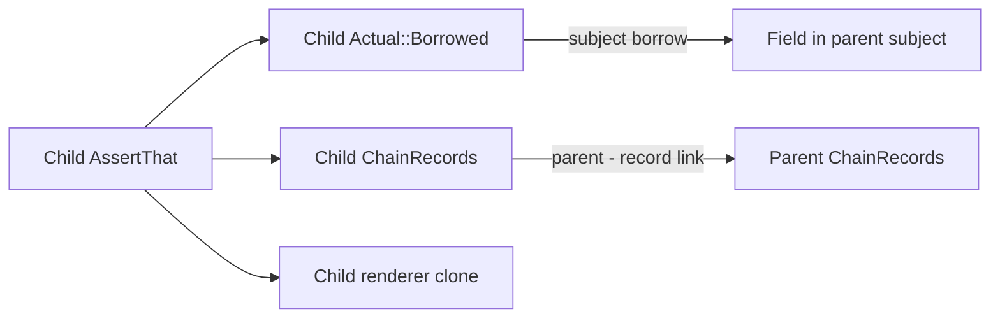

# Assertion lifecycle

[Architecture overview](README.md)

An assertion chain combines a subject, a failure mode, and diagnostic state. Mapping transfers that state to a new
subject. Derivation creates a child that reports to its parent.

## Chain representation

[`AssertThat<'t, T, M, R>`](../assertr/src/lib.rs) separates subject storage from transferable state:

| Part                     | Contract                                                                                                   |
|--------------------------|------------------------------------------------------------------------------------------------------------|
| `Actual<'t, T>`          | Holds `Borrowed(&T)` or `Owned(T)`. `T` selects subject capabilities.                                      |
| `M: Mode`                | Sealed to `Panic` and `Capture`. Rust selects failure handling at compile time.                            |
| `R`                      | Active renderer. Each method requires only the rendering capabilities it uses.                             |
| `ChainState` (private)   | Mode, renderer, diagnostic settings, subject name, expression, and records. Has no subject type parameter. |
| `ChainRecords` (private) | Local detail messages, assertion count, captured failures, and an optional parent-record link.             |

A root has no parent-record link. A child has its own records, whose parent link exposes only ancestor records. Its
subject may separately borrow a projection of the parent's subject. The link does not expose the ancestor's subject,
renderer, or presentation adapter. Counts propagate through every ancestor, captured failures go to the root, and
diagnostics collect local messages before ancestor messages.

For `root.derive` selecting a field, the two borrows are distinct:

The [projection implementation](../assertr/src/assert_that/projection.rs) creates both links. The subject borrow still
contributes its own lifetime and unwind-safety requirements.

## Entry, subject ownership, and mode

[`assert_that!`](../assertr/src/entry/mod.rs) borrows its input and records its expression text. For sized pointees, a
value and one reference layer select the same subject type. Unsized strings and slices remain reference-typed subjects.
`assert_that_owned!` owns its input, including the reference itself when given `&T`.

Ownership is a runtime property of `Actual`, independent of the mode. A consuming assertion on a borrowed subject panics
as misuse when it takes the value. A failed assertion follows the mode. `Panic` presents the first failure and panics.
`Capture` stores failures so checks can continue. An extraction that has no continuation on failure requires
`Panic`.

[`capture`](../assertr/src/assert_that/capture.rs) converts a panic-mode chain into a capture root. It resets the count,
detaches any parent link, and retains inherited detail messages. Its callback must return the supplied chain or a mapped
continuation. Completion checks that returned chain's count and takes its failures. No assertions means a misuse panic.
Capture neither catches user panics nor invokes panic presentation, and no completion check runs in `Drop`.

## Projections and continuation

The [projection methods](../assertr/src/assert_that/projection.rs) differ in state ownership:

| Operation                                       | State and metadata                                                                                   | Renderer                 |
|-------------------------------------------------|------------------------------------------------------------------------------------------------------|--------------------------|
| `map`, `map_owned`, `map_async`                 | Move the existing state, preserving records, name, and expression.                                   | Moved. No `Clone` bound. |
| `derive`, `derive_owned`, `derive_async`        | Create a child. Inherit diagnostic settings, mode, and ancestor messages. Clear name and expression. | Cloned.                  |
| `satisfies`, `satisfies_owned`, `satisfies_ref` | Give a derived child to a callback, then return the original chain.                                  | Cloned for the child.    |

`map` transforms `Actual<T>` into `Actual<U>`. `map_owned` first copies through `ToOwned`, even for an owned subject.
`map_async` awaits a new owned subject. `derive` borrows a sized projection. `derive_owned` and `derive_async` store the
mapper's result, which may itself be a reference to an unsized target. Derivation does not require cloning the subject.
Mapping and projection do not count as assertions. Checks performed on their continuations do.

The storage-level `Actual::map` consumes its receiver and invokes an `FnOnce` mapper exactly once. It returns the
mapper's owned or borrowed subject unchanged, allowing captured values to move into the result.

Within capture, return the root or its mapped continuation after checking children. A child borrows the root and cannot
replace that local root as the callback's returned chain. Expression attachment for fluent verification is owned by
[fluent entry](fluent-entry.md#scoped-expression-capture).

## Capture and continuation trace

Consider a named capture root over `[1, 2]`, with expression `values`. The callback checks its first element, then maps
the root to the length and checks that length. Both checks fail:

| Step                       | Root count and failures                                      | Subject metadata                            |
|----------------------------|--------------------------------------------------------------|---------------------------------------------|
| Enter capture              | Count 0, no failures.                                        | Root name and `values` expression retained. |
| Derive the first element   | Unchanged. The child borrows the element and parent records. | Child name and expression start empty.      |
| Check the child against 9  | Count 1. Child failure stored at the root.                   | Failure has the child's metadata.           |
| Map the root to length 2   | Count and stored failure move into the continuation.         | Root name and expression retained.          |
| Check the length against 3 | Count 2. Second failure appended.                            | Failure has the mapped root's metadata.     |
| Return the mapped root     | Capture returns both failures in raise order.                | Each failure keeps its own metadata.        |

The callback must return the supplied root or its continuation. Completion reads the returned chain's records, so a new
unrelated chain would not collect the original root's work. The executable examples live in the
[projection rustdoc](../assertr/src/assert_that/projection.rs). The regression
[`returned_context_collects_projections_and_renderer_changes_once`](../assertr/src/assert_that/capture.rs)
pins propagation through child checks and renderer changes.

## Unwind safety

The chain's fields determine its unwind-safety auto traits in both modes:

| Trait           | Subject requirement             | Renderer requirement |
|-----------------|---------------------------------|----------------------|
| `UnwindSafe`    | `T: UnwindSafe + RefUnwindSafe` | `R: UnwindSafe`      |
| `RefUnwindSafe` | `T: RefUnwindSafe`              | `R: RefUnwindSafe`   |

`Actual<T>` may hold either `T` or `&T`, so the active ownership variant cannot relax these bounds. Ordinary
construction, projections, and callbacks add no unwind bounds. The three record cells have local `AssertUnwindSafe`
exemptions. Conversions and rendering finish before mutable record borrows. Unwinding releases guards but does not undo
completed records or user effects. Subjects, renderers, and panic adapters stay outside those exemptions.

Panic-catching invocation and polling are
separate [observation boundaries](observation-boundaries.md#invocation-and-polling). Those execution adapters accept
mutable captures with localized exemptions. This does not grant unwind safety to an arbitrary assertion chain or roll
back user state.
